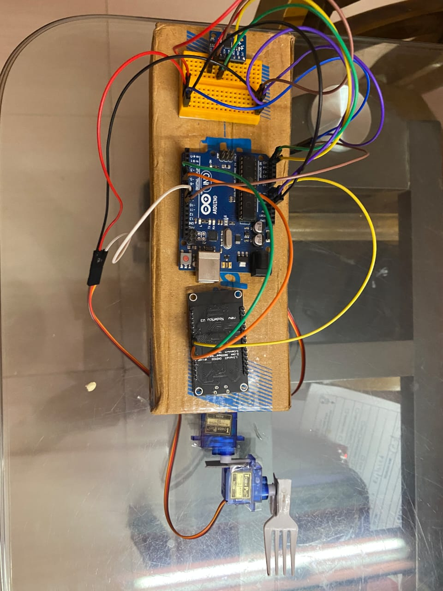

# Team-Chiral_Bitbox

Parkinson’s disease is a neurological degenerative disease that results in irrepressible shivers in the limbs. Due to unintended tremors in their arms, patients are unable to perform everyday menial tasks like eating food out of a bowl.
Using the principles of IoT and sensor networks we have created a stabilizing spoon for patients suffering from Parkinson’s disease.
The stabilizing spoon compensates for unintended tremors or shivers received from the user and calibrates its head against these forces, thus keeping the spoon bowl stable at all times. 
This spoon can move as quickly as 500°/second, hence effectively steadying the spoon. 

&nbsp;&nbsp;&nbsp; &nbsp;&nbsp; &nbsp;&nbsp;&nbsp; &nbsp;&nbsp;&nbsp; &nbsp;&nbsp;&nbsp; &nbsp;&nbsp;&nbsp; &nbsp;&nbsp;&nbsp;&nbsp;&nbsp;&nbsp; &nbsp;&nbsp; &nbsp;&nbsp;&nbsp; &nbsp;&nbsp;&nbsp; &nbsp;&nbsp;&nbsp; &nbsp;&nbsp;&nbsp; &nbsp;&nbsp;&nbsp;

Another part of the holistic product is a mobile application for a designated doctor to monitor the patient’s progress. 
During this pandemic, people have been terrified of entering hospitals for non-COVID diseases and ailments, and we aim to create and market a product to help people adjust better with this new norm.
We have developed an application which analyses data collected from the spoon via sensors, and statistically displays it to the designated doctor.
By using this application, a doctor can not only monitor your progress but also offer diagnosis and treatment remotely, without the patient needing to leave their home.

 &nbsp;&nbsp;&nbsp;  &nbsp;&nbsp;&nbsp; &nbsp;&nbsp;&nbsp;&nbsp;&nbsp;&nbsp; &nbsp;&nbsp;&nbsp;  &nbsp;&nbsp;&nbsp;  

With this project, the absolute aim is to make a product which can make a patient’s life easier.
The product will not only make it easy for the user to eat food out of a plate/bowl, but also help their recovery by enabling inexpensive and thorough communication with a designated doctor.
In an age where people are petrified of the thought of entering the premises of a hospital, we are trying to use all the technological experience we have to create an experience which avoids as much physical contact as possible.
In case of neuro diseases associated with nerves and muscles, it is imperative for the doctor to check up on the patient’s movements regularly, but we have attempted to find a way for doing that without requiring the patient to ever enter a hospital. 

